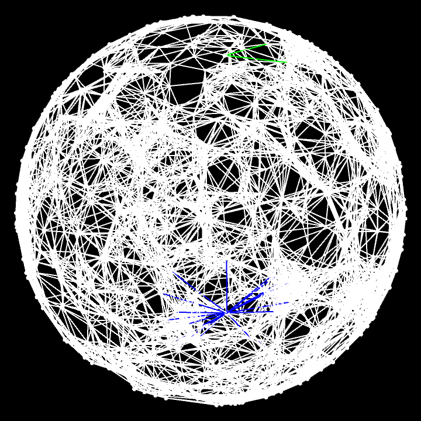
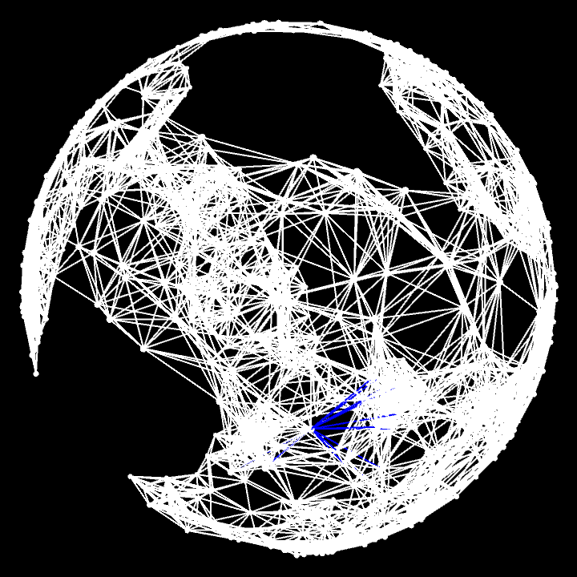
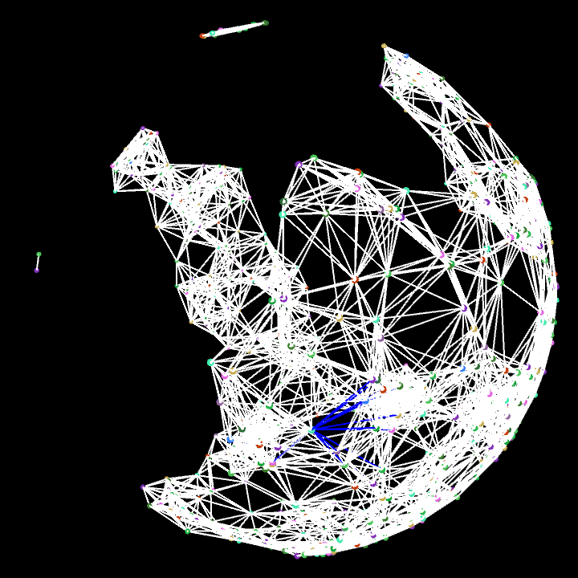
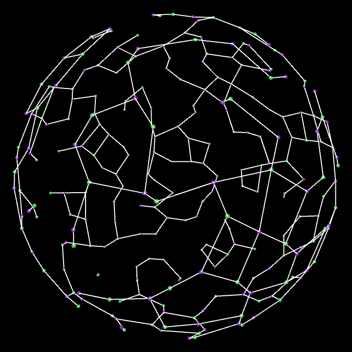
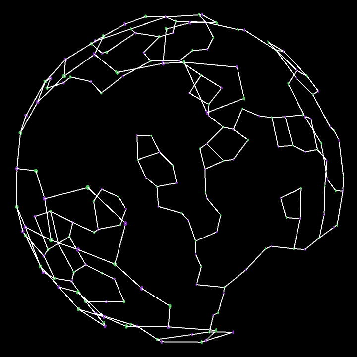
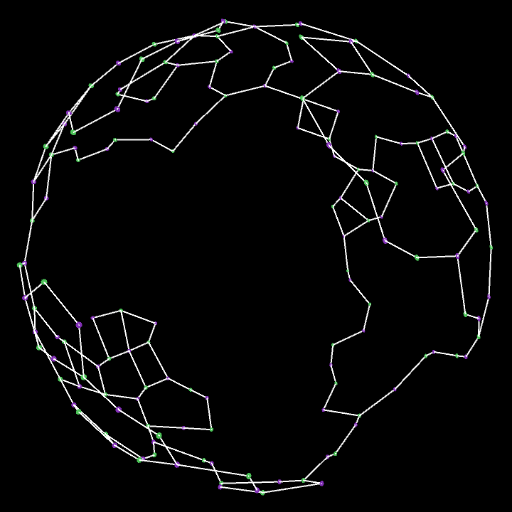
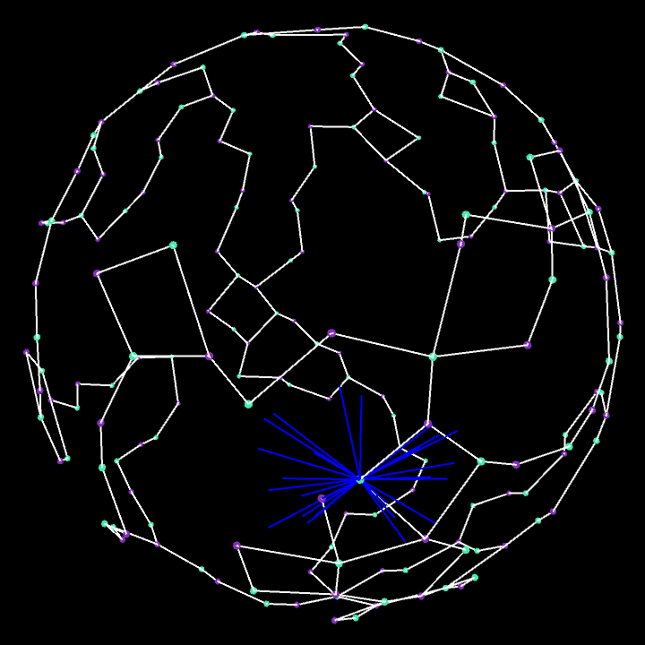

# Backbone Determination in Wireless Sensor Network
This project finds the largest backbone for a wireless sensor network by finding the bipartite subgraphs of a given geometry. The supported geometries are the unit square, unit disk, and unit sphere. Nodes are uniformly distributed across the geometry. Then, the edges are determined such that a desired connection rate is met. Then, the nodes are colored using smallest-last vertex ordering and greedy graph coloring. The combinations of the largest independent color sets are processed to find the largest backbone for the sensor network.

All algorithms used to generate the graphs and find the lagest bipartites are implemented to run in linear time.

## Images

### Random Geometric Graph (RGG)
Uniformly distributed nodes on a sphere topology.

### Smallest-Last Vertex Ordering (SLVO)
A portion of the nodes removed following slvo.

### Graph Coloring
A portion of the nodes colored using greedy coloring.

### Bipartite Subgraph
The largest bipartite subgraph on the topology.

### Major Component
The largest component of the bipartite is taken.

### Removal of Bridges
Any part of the graph that is only connected through one edge is removed. This is desired so that two regions of the topology do not become disconnected if a single node fails.

### Backbone
The final largest backbone for the topology. This is pulled from a different bipartite than we have examined thus far.

## Usage
With Processing.py installed, you can run the Processing.pyde project in the Processing folder. You can specify the number of nodes and the desired average number of connections for the network.

With the simulation running, you can use the `h` and `l` keys to move between the results of the different algorithms. You can use `j` and `k` to step through node removal and coloring, or the different bipartites generated. Using a number key will increase the step size to 2^n. Press `m` at any time to view the help menu.
